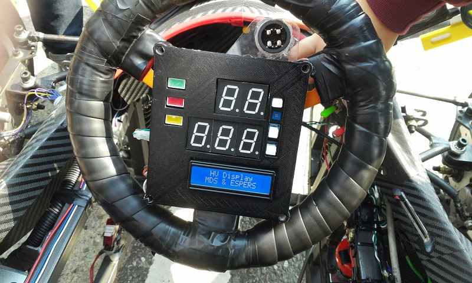
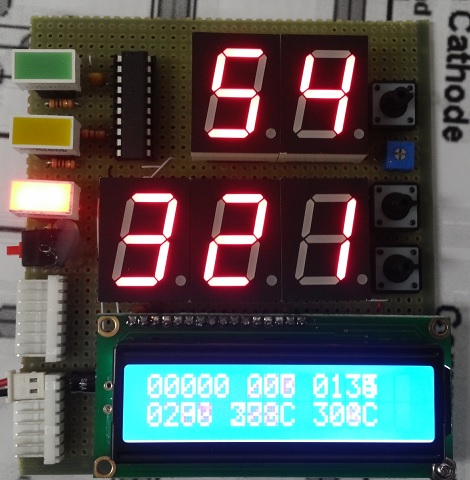

# Hybrid-Vehicle-Display-Board

IDE: Atmel AVR Studio 4  
Microcontroller: Atmel AVR Atmega16  

The board checks and displays  
- Vehicle speed   
- Driving distance  
- Lap time  
- Driving motor temperature  
- Driving Modes(Hybrid, Eletric only, Engine only)
- Battery Status

